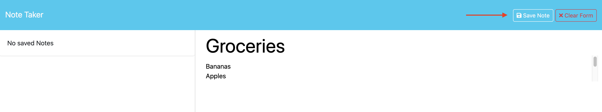
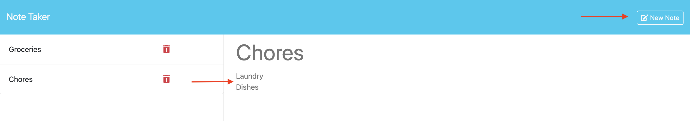

# Express Note Taker

## Description
This note taker application was designed to give users a place to create and save notes that persist in the back end. I created an Express.js server that handles HTTP requests made by the client to get existing notes, post new notes and delete unwanted notes (CRUD). This project taught me how to write APIs and handle routing of client requests. It also helped me practice sending data to a database through these client requests as well as writing back-end code to existing front-end code.

## Installation
n/a

## Usage
Once the user types a title and text for a new note, click the 'Save Note' button in the navigation bar.

To see contents of a previous note, click the note and it will display on the right.

## Credits
Starter code: https://github.com/coding-boot-camp/miniature-eureka

uuid: https://www.npmjs.com/package/uuid?activeTab=readme

## License
n/a

